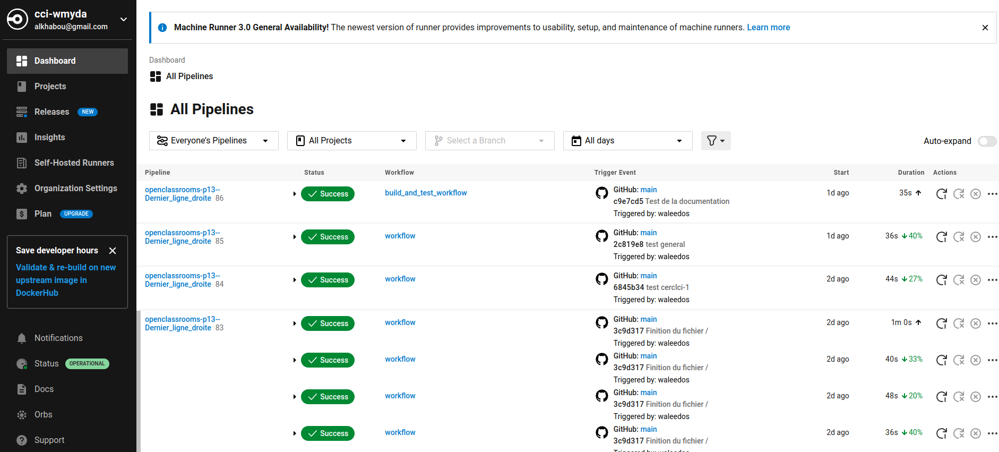

Déploiement CircleCI
--------------------

Commencez par créer un compte gratuit sur la plateforme **`CircleCI<https://circleci.com/>`_**

Lors de la création de ce compte, vous serez amenés à répondre à quelque question comme suit :

- Are you joining a team on CircleCI?    Répondez par - non

- Mettez ensuite votre adresse e-mail et un bon password.

- Une fois vous confirmez votre e-mail, commencez par créer un nouveau projet.

- Informez **`CircleCI<https://circleci.com/>`_** que vous souhaiteriez importer votre projet depuis **`GitHub<https://github.com/>`_**.

- Renseignez les identifiants de votre compte GitHub avec le « répos » de votre projet.

.. ATTENTION::

    *La communication entre CircleCI et GitHub se fait par via une authentification avec une clé SSH*

    *Prenez soin avec tout votre temps pour générer et implémenter une seule et nouvelle Clé SSH dans CircleCI et GitHub "la même"*

Une fois ces étapes précedentes sont achevées, vérifiez bien du coté de "GitHub", et plus specifiquement dans la rubrique **Applications** que vos deux compte GitHub et CircleCI sont reliés.

**Implémentation de CircleCI dans notre code**

.. raw:: html

   <u>Créez un dossier à la racine du projet</u>

En ligne de commande, rendez vous à la racine du projet, et créez un dossier nommé ".circleci" avec la commande suivante:

.. code:: shell
    
    mkdir .circleci

.. raw:: html

   <u>Créez dans ce dossier un fichier nommé "</u>

.. code:: shell
    
    config.yml

C'est le fichier unique de la configuration de CircleCI pour notre projet.

*Normalement, et lors de la crétion du projet sur CircleCI, ce dernier nous propose un type de ce fichier pour la configuration initiale*

Voici un exemple de ce fichier : 

.. code-block:: yaml

    version: 2.1
    jobs:
      build:
        docker:
          - image: cimg/python:3.8
        steps:
          - checkout
          - setup_remote_docker
          - run:
              name: Install dependencies
              command: |
                pip install docker-compose
          - run:
              name: Build and run tests
              command: |
                docker-compose up --build -d
                docker-compose exec web python manage.py test
    workflows:
      version: 2
      build_and_test:
        jobs:
          - build

Le fichier ``config.yml`` est un élément central des projets qui utilisent CircleCI pour l'intégration et le déploiement continu (CI/CD). Ce fichier YAML définit la configuration de votre pipeline CI/CD, en spécifiant les actions que CircleCI doit exécuter à chaque fois que des modifications sont apportées à votre code source. Voici une explication détaillée des composants clés de la configuration que vous avez fournie :

**Explications**

- **version** : Indique la version de la configuration CircleCI utilisée. ``2.1`` est actuellement la version la plus couramment utilisée, permettant d'utiliser toutes les fonctionnalités avancées de CircleCI, comme les orbs, les paramètres réutilisables, et les pipelines conditionnels.

- **jobs** : Définit un ensemble de tâches (ou "jobs") que le pipeline doit exécuter. Les jobs sont les unités de travail les plus fondamentales dans un pipeline CircleCI. Chaque job peut s'exécuter indépendamment dans un environnement isolé.
  
    - **build** : Nom du job. Ici, ``build`` est un job personnalisé qui, dans cet exemple, est conçu pour construire votre projet, installer les dépendances et exécuter les tests.
    
        - **docker** : Spécifie que ce job doit s'exécuter dans un conteneur Docker. ``image: cimg/python:3.8`` indique l'image Docker à utiliser pour l'environnement d'exécution, ici une image CircleCI officielle pour Python 3.8.
    
        - **steps** : Séquence d'étapes à exécuter dans ce job. Chaque étape peut exécuter une commande, utiliser un orb, restaurer des caches, etc.
      
            - **checkout** : Une étape spéciale qui extrait le code source du projet dans l'environnement d'exécution du job.
      
            - **setup_remote_docker** : Permet l'utilisation de Docker au sein du job, essentiel pour les tâches qui nécessitent la construction ou le déploiement de conteneurs Docker.
      
            - **run** : Exécute des commandes shell. Ici, il y a deux blocs ``run`` :
        
                - Le premier installe ``docker-compose``.
        
                - Le second construit l'environnement avec ``docker-compose up --build -d`` et exécute les tests avec ``docker-compose exec web python manage.py test``.

**Workflows**

- **workflows** : Définit comment les jobs sont organisés et dans quel ordre ils doivent être exécutés. Les workflows permettent d'orchestrer l'exécution des jobs, y compris leur exécution en parallèle, en séquence, ou sous certaines conditions.
  
  - **version** : Similaire à la version de configuration CircleCI, spécifie la version des workflows utilisés.
  
  - **build_and_test** : Nom du workflow. Ici, cela suggère que le workflow est destiné à construire le projet et à exécuter les tests.
    
    - **jobs** : Liste des jobs à exécuter dans ce workflow. Dans cet exemple, seul le job ``build`` est exécuté.

*Cette configuration crée un pipeline CI/CD simple mais efficace, où chaque push au dépôt déclenche l'exécution du job ``build``, qui construit le projet dans un conteneur Docker et exécute les tests.* *C'est une base solide pour tout projet Django souhaitant implémenter l'intégration continue avec CircleCI, et elle peut être étendue avec des jobs supplémentaires pour le déploiement, la vérification de la qualité du code, etc.*

voici une capture d'ecran de notre Pipeline de notre compte sur CircleCI.com : 

--

.. raw:: html

    <a href="https://raw.githubusercontent.com/waleedos/2023_P13_mettez_a_l-echelle_une_application_Django_en_utilisant-_une_architecture_modulaire/main/docs/source/_static/circleci.png" target="_blank">Agrandir et voir cette Image sur une autre plateforme</a>

--    

.. image:: https://dl.circleci.com/status-badge/img/circleci/KAm3csFwG5HBdy4u7bCNVZ/oZnMfYKgjjwBGnytLcqNa/tree/main.svg?style=svg&circle-token=2bdb6c762403bb676618fc41911c652359f9c01b
        :target: https://dl.circleci.com/status-badge/redirect/circleci/KAm3csFwG5HBdy4u7bCNVZ/oZnMfYKgjjwBGnytLcqNa/tree/main

--

.. image:: https://dl.circleci.com/insights-snapshot/circleci/KAm3csFwG5HBdy4u7bCNVZ/oZnMfYKgjjwBGnytLcqNa/main/build_and_test_workflow/badge.svg?window=30d&circle-token=34c520fcdef8fdf857bb895e1dbfe05df93ada07
        :target: https://app.circleci.com/insights/circleci/KAm3csFwG5HBdy4u7bCNVZ/oZnMfYKgjjwBGnytLcqNa/workflows/build_and_test_workflow/overview?branch=main&reporting-window=last-30-days&insights-snapshot=true

.. Fin du document