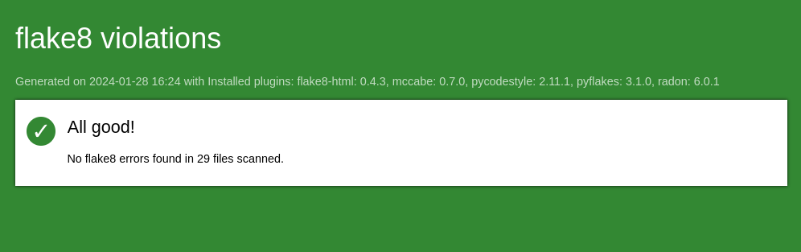

Assurance de la qualité du code Flake8
--------------------------------------

**flake8**

*Flake8, en 2024, demeure un outil essentiel pour la programmation Python, combinant les fonctionnalités de pyflakes, mccabe, et pep8.*

*Il est utilisé pour vérifier le style de codage et la qualité logique du code Python.* 

*Flake8 aide les développeurs à identifier les erreurs potentielles, les styles de codage non conformes aux normes PEP 8, et les problèmes de complexité.* 

*Il facilite la maintenance du code en assurant une cohérence stylistique et en améliorant sa lisibilité.* 

*Il est largement intégré dans les environnements de développement intégrés (IDE) et les pipelines CI/CD, renforçant les pratiques de codage propre et efficace.*

**Configuration de flake8**

*Avant de penser à la configuration de flake8, il faut d'abord l'installer dans l'environnement virtuel du projet ainsi que ses composantes.*
*Pour cela utilisez les commandes suivantes :*

.. code:: shell

   pip install flake8

   et

   pip install flake8-html

Afin d'élaborer un rapport de toutes les erreurs exisatntes et pouvoir les corriger, il faut d'abord configurer flake8.

Pour cela, il faut créer un fichier nommé ".flake8" à la racine du projet, et dans l'exemple de ce projet, voici le contenu de ce fichier : 

.. code:: shell

    [flake8]
    max-line-length = 99
    exclude = venv, .git, .gitignore, __pycache__, env, vmigrations, migrations

Maintenant que tout les reglages sont faits, nous pouvons utiliser la commande suivante, qui garce à la quelle, un dossier nommé *flake-report* va etre créé à la racine du projet, et nous trouverons dedans un fichier *index.html* consultable dans un navigateur, pour voir toutes les erreurs détéctées en détails : 

.. code:: shell
    
    flake8 --format=html --htmldir=flake-report

--

--

.. raw:: html

    <a href="https://raw.githubusercontent.com/waleedos/2023_P13_mettez_a_l-echelle_une_application_Django_en_utilisant-_une_architecture_modulaire/main/docs/source/_static/flake8.png" target="_blank">Agrandir et voir cette Image sur une autre plateforme</a>

--    

