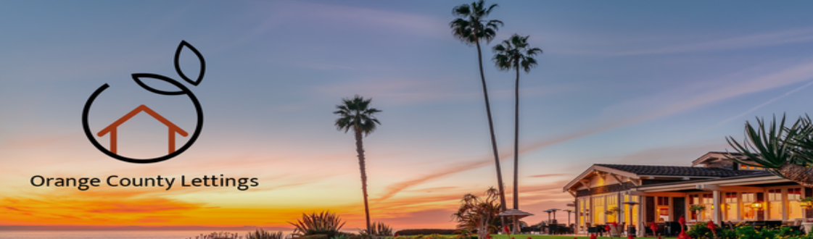

Technologies et Langages de programmation utilisés
--------------------------------------------------

`Python <https://www.python.org/>`_ est le langage de programmation de choix pour ce projet. Sa version utilisée dans ce projet est **Python 3.11.7**

Ceci est une application web `**Django** <https://www.djangoproject.com>`_.

Django est un framework Web écrit en Python qui vous permet de créer des applications sous le paradigme MVC (Model View Controller).

Django propose une interface d'administration accessible via un navigateur web.

`**Docker** <https://www.docker.com/>`_ et `**Docker Compose** <https://docs.docker.com/compose/>`_ sont utilisés pour rendre cette application portable.

Avec **Docker**, vous pouvez créer des conteneurs pour isoler vos applications et disposer d'environnements reproductibles sur différentes plateformes.

Docker Compose vous permet de créer des définitions d'environnement pour votre application : au lieu d'écrire manuellement des commandes Docker complètes ou de créer des scripts shell, avec Docker Compose, vous pouvez définir tous les détails dans un fichier YAML et lancer les applications avec une seule commande. Vous pouvez également combiner plusieurs applications dans un seul fichier et les gérer en tant que dépendances d'une application principale.

Cette documentation a été rédigée via `**Sphinx** <https://www.sphinx-doc.org/en/master/>`_.

Sphinx vous permet de créer de belles pages de documentation et possède plusieurs fonctionnalités. L’un d’eux est la possibilité de lire des docstrings directement à partir du code Python, afin que vous puissiez documenter les API, les fonctions, les classes, etc...