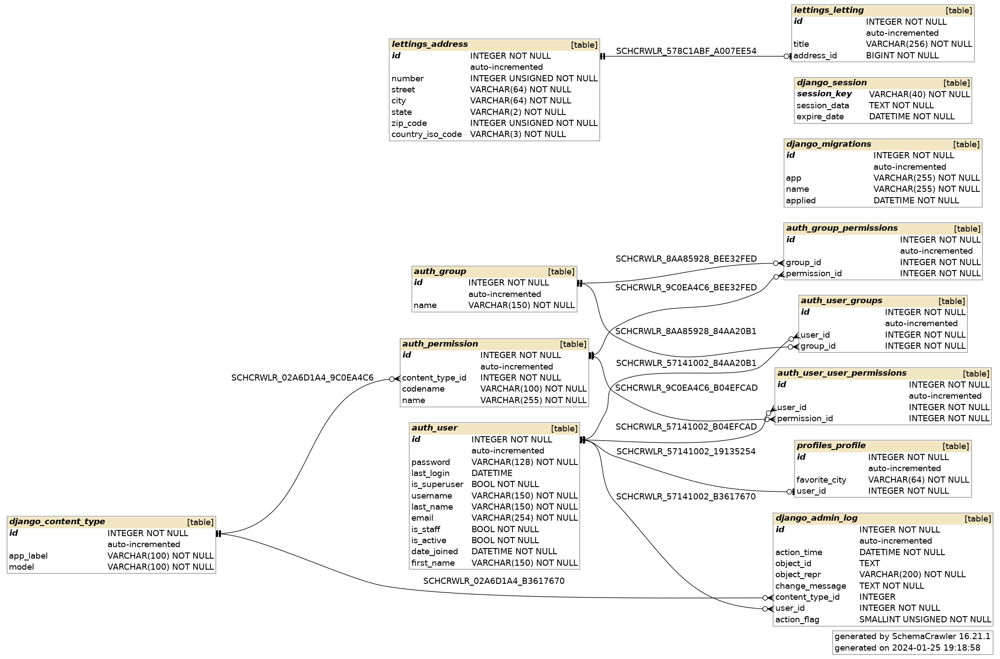

Structure de la base de données
-------------------------------

**S'assurer que vous êtes dans le répertoire du projet :**

.. code:: shell

   cd [Nom_du_répertoire_du_projet]

**Ouvrez une session Shell pour sqlite :**

.. code:: shell

   sqlite3

**Connectez-vous à la base de données :**

.. code:: shell

   .open oc-lettings-site.sqlite3

**Afficher les tables dans la base de données :**

   .. code:: shell

      .tables

**Afficher par exemple les colonnes dans le tableau des profils :**

.. code:: shell
   
   PRAGMA table_info("profiles_profile");

**Lancer une requête sur la table des profils pour filtrer uniquement les enregistrements où la valeur de la colonne favorite_city commence par la lettre 'B' :**

.. code:: shell

   select user_id, favorite_city from profiles_profile where favorite_city like 'B%';

**Voici le diagramme de notre base de données**

--

.. raw:: html

    <a href="https://raw.githubusercontent.com/waleedos/2023_P13_mettez_a_l-echelle_une_application_Django_en_utilisant-_une_architecture_modulaire/main/docs/source/_static/diagramme.png" target="_blank">Agrandir et voir cette Image sur une autre plateforme</a>

--

