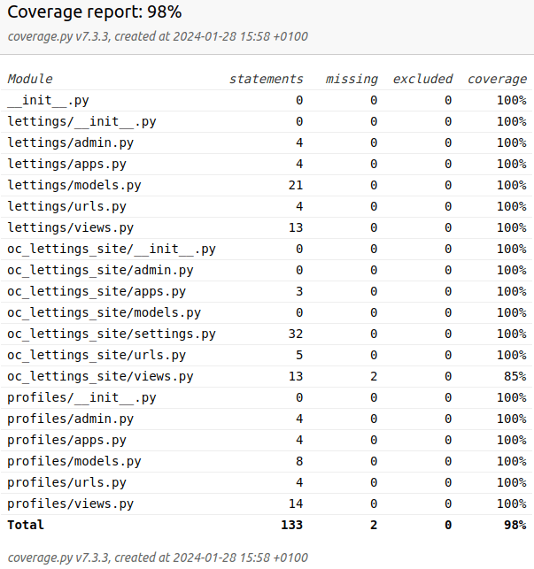

Les Tests de coverage
---------------------

*Les tests de coverage dans ce projet servent à évaluer la proportion du code source qui est testée par les tests unitaires et d'intégration.* 

*Ils permettent d'identifier les parties du code qui ne sont pas couvertes par les tests, aidant ainsi à améliorer la qualité et la fiabilité du logiciel.* 

*Les rapports de coverage offrent une vue d'ensemble de la couverture de tests, indiquant où des efforts supplémentaires sont nécessaires pour garantir une couverture de test complète et efficace de votre application.*

Il est impératif de vérifier que la couverture de test est supérieure à 80 %.

Nous pouvons executer ces tests de coverage via 3 commandes differentes

Nous devrions en premier lieux s'assurer du Path de notre projet :

.. code:: shell
   
   export PYTHONPATH=$PYTHONPATH:/xxxx/xxxxx/Bureau/oc_p13

**1- 1ere méthode :** 

.. code:: shell
   
   coverage report

Cela nous donne sur la console, un pourcentage globale de la couverture de nos tests pour le projet.

**2- 2eme Méthode**

.. code:: shell
   
   coverage run manage.py test

Cette commande nous donne aussi sur la console, un pourcentage globale de la couverture de nos tests pour le projet, mais avec beaucoup plus de details.

**3- 3eme Méthode**

.. code:: shell
   
   coverage html

Cette commande va créer un dossier à la racine nommé *htmlcov*, et dans lequel, nous trouverons un fichier *index.html*, consultable par vos navigateurs, pour afficher le résultat final de ce test de coverage.

--

.. raw:: html

    <a href="https://raw.githubusercontent.com/waleedos/2023_P13_mettez_a_l-echelle_une_application_Django_en_utilisant-_une_architecture_modulaire/main/docs/source/_static/coverage.png" target="_blank">Agrandir et voir cette Image sur une autre plateforme</a>

--    

.. Fin du document

