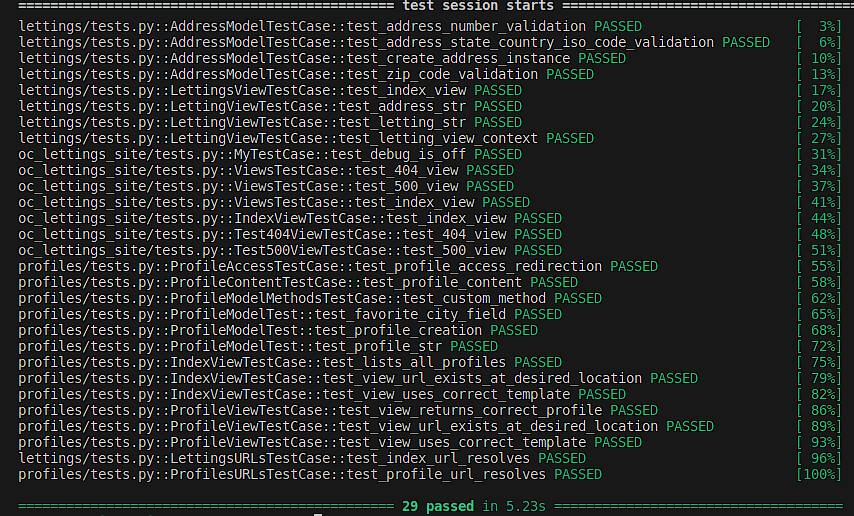

Les Tests Unitaires
-------------------

- `cd /path/to/Python-OC-Lettings-FR`
- `source venv/bin/activate`
- `pytest`

**Dans ce projet, nous comptons 3 applications Django :**

- L'application lettings
- L'application oc_lettings_site
- L'application profiles

Dans chaque dossier de ces 3 applications, existe un fichier nommé (test.py) dans lequel nous avons élaborer les tests necessaires pour cette application : 

- Pour l'application lettings         : Nous avons 9 tests.
- Pour l'application oc_lettings_site : Nous avons 7 tests.
- Pour l'application profiles         : Nous avons 13 tests.

**Execution des tests séparement:**

Pour executer les tests d'une application précise, nous pouvons utiliser trois méthodes : 

**1- Lancer la commande 'pytest' dans le repertoire de l'application en question :**

.. code:: shell
   
   cd profiles

   Puis

   pytest

Cela execute tous les tests existants dans le fichier "tests.py" de l'application "profiles"

**2- Lancer la commande pytest depuis le dossier racine du projet :**

.. code:: shell
   
   pytest profiles/tests

Cela execute aussi tous les tests existants dans le fichier "tests.py" de l'application "profiles"

**3- Execution d'un seul test existant dans le fichier "test.py"**

.. code:: shell
   
   pytest profiles/tests.py::NomDeLaClasseDeTest::NomDuTestEnQuestion

Par exemple dans notre cas, nous voudrions executer le test test_profile_access_redirection

.. code:: shell
   
   pytest profiles/tests.py::ProfileAccessTestCase::test_profile_access_redirection

**Execution de tous les tests globalement depuis la racine du projet:**

.. code:: shell

   pytest

--

.. raw:: html

    <a href="https://raw.githubusercontent.com/waleedos/2023_P13_mettez_a_l-echelle_une_application_Django_en_utilisant-_une_architecture_modulaire/main/docs/source/_static/pytest.png" target="_blank">Agrandir et voir cette Image sur une autre plateforme</a>

--    
.. Fin du document